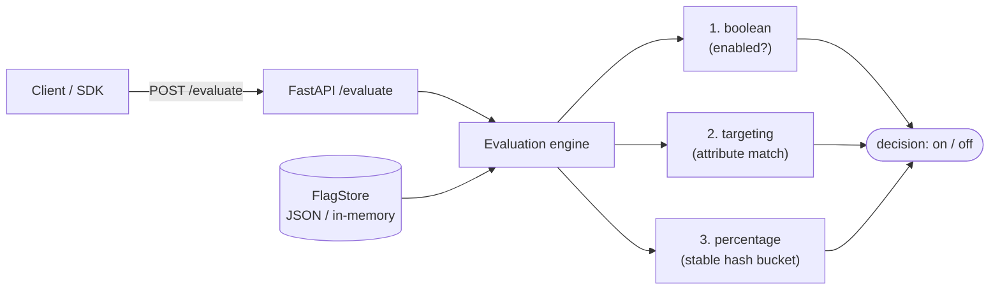

# Feature Flags Service

> A lightweight feature-flag service with boolean flags, percentage rollouts, and attribute targeting — plus a tiny Python SDK.


## Overview

Feature Flags Service is a small, self-contained flag system you can run locally
with no external dependencies. It supports three decision types that compose in a
clear precedence order:

- **Boolean flags** — a master on/off kill switch per flag.
- **Percentage rollouts** — ship to *N%* of users, with the bucket **stable per
  user** so a given user never flip-flops between requests or deployments.
- **Targeting rules** — turn a flag on for users whose attributes match (e.g.
  `country in [DE, FR]` or `plan == internal`).

A REST API manages and evaluates flags, and a tiny Python client SDK wraps the
`/evaluate` endpoint. Storage is an in-memory dict with optional JSON-file
persistence, isolated behind a single `FlagStore` class so it is swappable for a
real backend without touching the rest of the service.

> Portfolio / demo project — built to showcase design and implementation, not as a production service.

## Architecture



## Features

- Boolean on/off flags (kill switch).
- Percentage rollouts with deterministic per-user bucketing via `hashlib.sha256`.
- Simple targeting rules: `eq`, `neq`, `in`, `contains`.
- REST API: full CRUD for flags plus `POST /evaluate`.
- Tiny Python SDK (`FeatureFlagsClient`).
- JSON-file or in-memory store behind one swappable seam.
- Fully offline; no external services.

## Tech stack

- **Python 3.11+**
- **FastAPI** for the REST API
- **pydantic v2** for models and validation
- **hashlib** (stdlib) for stable bucketing
- **httpx** for the SDK transport
- **pytest** for tests

## Getting started

```bash
# Create a virtual environment and install (editable)
python -m venv .venv
source .venv/bin/activate        # Windows: .venv\Scripts\activate
pip install -e ".[dev]"

# Seed the store from the example flags, then run the API
cp data/flags.example.json data/flags.json
uvicorn featureflags.main:app --reload
```

Interactive API docs are then available at http://localhost:8000/docs.

## Usage

### Evaluate a flag over HTTP

```bash
curl -s -X POST http://localhost:8000/evaluate \
  -H "Content-Type: application/json" \
  -d '{"flag": "eu-pricing", "user": "user-123", "attributes": {"country": "DE"}}'
```

```json
{ "flag": "eu-pricing", "user": "user-123", "enabled": true, "reason": "targeting" }
```

### Manage flags

```bash
# Create or replace a flag
curl -s -X PUT http://localhost:8000/flags/beta-search \
  -H "Content-Type: application/json" \
  -d '{"key": "beta-search", "enabled": true, "rollout_percentage": 25, "rules": []}'

# List flags
curl -s http://localhost:8000/flags
```

### Python SDK

```python
from featureflags.client import FeatureFlagsClient

with FeatureFlagsClient("http://localhost:8000") as client:
    if client.is_enabled("eu-pricing", user="user-123", country="DE"):
        show_new_pricing()

    # Full payload (flag, user, enabled, reason)
    result = client.evaluate("beta-search", user="user-123")
```

## Evaluation rules

A flag is evaluated in this precedence order (see `featureflags/engine.py`):

1. **Boolean gate** — if `enabled` is `false`, the flag is OFF for everyone.
2. **Targeting** — each rule is checked against the user's attributes; if *any*
   rule matches, the flag is ON (regardless of the rollout percentage).
3. **Percentage** — otherwise the user is placed in a stable bucket:

   ```
   bucket = int(sha256(f"{flag_key}:{user}").hexdigest(), 16) % 100
   enabled = bucket < rollout_percentage
   ```

Because the hash is keyed on both the flag key and the user id, the outcome is
**deterministic**: the same user always lands in the same bucket for a given
flag (so no flicker across requests), while different flags bucket the same user
independently. Across many users the ON share converges to
`rollout_percentage`.

## Project structure

```
feature-flags-service/
├── featureflags/
│   ├── __init__.py
│   ├── models.py        # Flag, Rule, request/response models (pydantic)
│   ├── engine.py        # pure evaluation: boolean, targeting, percentage
│   ├── store.py         # FlagStore: in-memory + JSON persistence (swappable)
│   ├── main.py          # FastAPI app: CRUD + /evaluate
│   └── client.py        # tiny Python SDK
├── data/
│   └── flags.example.json
├── tests/
│   ├── test_engine.py   # boolean, stability, distribution, targeting
│   ├── test_api.py      # CRUD + /evaluate via TestClient
│   └── test_client.py   # SDK behavior
├── .github/workflows/ci.yml
├── pyproject.toml
├── requirements.txt
├── LICENSE
└── README.md
```

## Testing

```bash
pip install -e ".[dev]"
pytest -q
```

The suite covers: boolean on/off, percentage rollout stability for a user, the
rollout share matching the target percentage across ~10k users, targeting-rule
matches, and the SDK returning expected values.

## Roadmap

- Streaming flag updates (server-sent events / websockets) so clients react to
  changes without polling.
- An audit log recording who changed which flag and when.
- Pluggable stores (Redis / Postgres) behind the existing `FlagStore` seam.
- Multi-variant flags (beyond boolean on/off).

## License

MIT — see [LICENSE](LICENSE).

---

Part of my cloud & AI portfolio — see [github.com/matthews-wong](https://github.com/matthews-wong).
